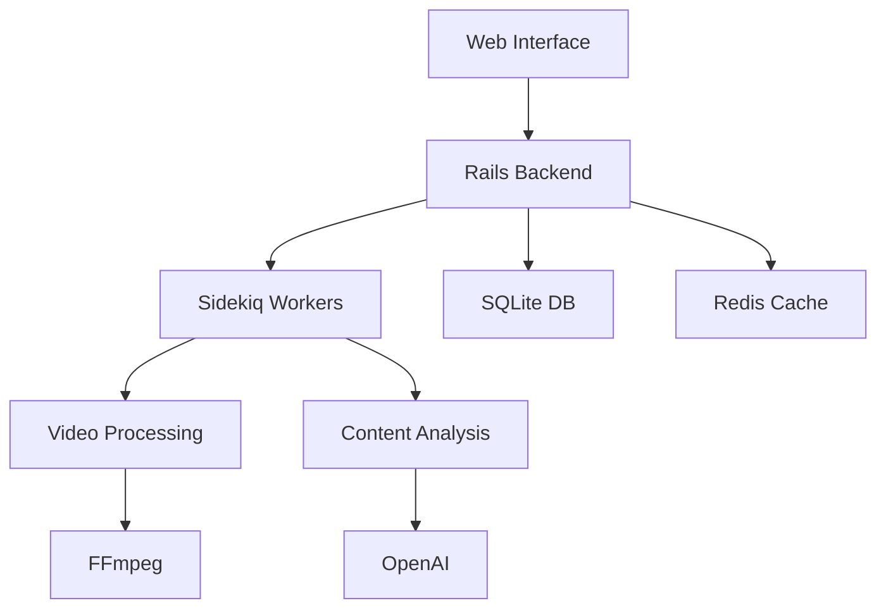

# Words of Truth

Transform sermons into engaging YouTube Shorts automatically with our AI-powered platform.

## 🌟 Features

### Content Generation
- 🎥 Automated sermon crawling from multiple sources
- 📝 AI-powered script generation
- 🎬 Dynamic video generation with background music
- 🗣️ Text-to-speech with natural voices
- 🎨 Beautiful visual transitions and effects
- 🎵 Background music library

### Management
- 📊 Comprehensive analytics dashboard
- 🔄 Real-time job progress monitoring
- 📱 Mobile-responsive interface
- 🎛️ Customizable video settings
- 📋 Batch processing capabilities
- 🏷️ Content tagging and categorization

### Automation
- ⚡ Scheduled content crawling
- 🤖 Automated video processing pipeline
- 📤 YouTube integration for uploads
- 📈 Performance tracking
- 🔔 Email notifications
- 🔄 Auto-retry mechanism for failed jobs

## 🚀 Quick Start

### Prerequisites

#### System Requirements
- CPU: 2+ cores recommended
- RAM: 4GB minimum, 8GB recommended
- Storage: 20GB+ free space
- OS: macOS 12+, Ubuntu 20.04+, or Windows 10/11

#### Software Requirements
- Ruby 3.2.2
- Rails 8.0.2
- Redis 6.0+
- SQLite3
- Node.js 18+
- FFmpeg 4.4+
- Python 3.8+ (for ML components)

### Installation

1. Clone the repository:
```bash
git clone https://github.com/yourusername/wordsoftruth.git
cd wordsoftruth
```

2. Install system dependencies:
```bash
# macOS
brew install redis ffmpeg python@3.8

# Ubuntu
sudo apt-get update
sudo apt-get install redis-server ffmpeg python3.8
```

3. Install Ruby dependencies:
```bash
bundle install
```

4. Set up environment:
```bash
cp .env.example .env
# Edit .env with your configuration
```

5. Initialize database:
```bash
rails db:create db:migrate db:seed
```

6. Start services:
```bash
# Terminal 1: Redis
redis-server

# Terminal 2: Sidekiq
bundle exec sidekiq

# Terminal 3: Rails server
bin/dev
```

## 🛠️ Configuration

### Environment Variables
- `REDIS_URL`: Redis connection URL
- `YOUTUBE_API_KEY`: Your YouTube API credentials
- `AWS_ACCESS_KEY`: AWS credentials for media storage
- `OPENAI_API_KEY`: OpenAI API key for content generation

### Customization
- `config/sidekiq.yml`: Job processing settings
- `config/schedule.yml`: Cron job schedules
- `config/video_templates/`: Video generation templates

## 📚 Documentation

- [Quick Start Guide](docs/QUICKSTART.md)
- [User Manual](docs/MANUAL.md)
- [API Documentation](docs/API.md)
- [Development Guide](docs/DEVELOPMENT.md)

## 🤝 Contributing

1. Fork the repository
2. Create your feature branch
3. Commit your changes
4. Push to the branch
5. Create a Pull Request

## 📝 License

This project is licensed under the MIT License - see the [LICENSE](LICENSE) file for details.

## 🙏 Acknowledgments

- OpenAI for AI capabilities
- FFmpeg for video processing
- YouTube API for content distribution
- Rails community for the framework
- All contributors and users

## 📧 Support

For support, email support@wordsoftruth.com or join our [Discord community](https://discord.gg/wordsoftruth).

## 🛠️ Development

### Architecture Overview


### Local Development
```bash
# Install development tools
gem install foreman
npm install -g yarn

# Set up development environment
bin/setup
cp .env.example .env.development

# Start development servers
bin/dev                 # Rails & assets
bundle exec sidekiq     # Background jobs
```

### Testing
```bash
# Run all tests
bundle exec rails test

# Run specific tests
bundle exec rails test test/models/sermon_test.rb
bundle exec rails test test/controllers/dashboard_controller_test.rb

# Run system tests
bundle exec rails test:system
```

### Code Quality
```bash
# Run linters
bundle exec rubocop
bundle exec erb-lint
yarn lint

# Run security checks
bundle exec brakeman
bundle exec bundle-audit
```

## 📦 Deployment

### Production Setup
1. Server Requirements
   - Ubuntu 20.04 LTS
   - Nginx 1.18+
   - PostgreSQL 13+
   - Redis 6+
   - FFmpeg 4.4+

2. SSL Configuration
   ```nginx
   # /etc/nginx/sites-available/wordsoftruth
   server {
       listen 443 ssl;
       server_name your-domain.com;
       
       ssl_certificate /path/to/cert.pem;
       ssl_certificate_key /path/to/key.pem;
       
       location / {
           proxy_pass http://localhost:3000;
           proxy_set_header Host $host;
           proxy_set_header X-Real-IP $remote_addr;
       }
   }
   ```

3. Database Setup
   ```bash
   # Create production database
   RAILS_ENV=production bundle exec rails db:create
   RAILS_ENV=production bundle exec rails db:migrate
   
   # Generate secure credentials
   EDITOR="vim" bin/rails credentials:edit
   ```

### Monitoring
1. Health Checks
   ```ruby
   # config/routes.rb
   get '/health', to: 'monitoring#health'
   get '/readiness', to: 'monitoring#readiness'
   ```

2. Error Tracking
   ```ruby
   # config/initializers/sentry.rb
   Sentry.init do |config|
     config.dsn = ENV['SENTRY_DSN']
     config.environment = Rails.env
   end
   ```

3. Performance Monitoring
   ```ruby
   # config/initializers/skylight.rb
   Skylight.configure do |config|
     config.environment = Rails.env
   end
   ```

### Backup Strategy
1. Database Backups
   ```bash
   # Daily backups
   0 0 * * * /usr/bin/pg_dump -U postgres wordsoftruth_production | gzip > /backups/db-$(date +\%Y\%m\%d).sql.gz
   
   # Keep last 30 days
   find /backups -type f -mtime +30 -delete
   ```

2. Media Backups
   ```bash
   # Sync to S3
   aws s3 sync /path/to/media s3://your-bucket/media
   ```

## 🤝 Community

### Contributing Guidelines

#### Code Style
- Follow Ruby Style Guide
- Write meaningful commit messages
- Include tests for new features
- Update documentation

#### Pull Request Process
1. Fork the repository
2. Create feature branch
3. Write tests
4. Update documentation
5. Submit PR

### Support Channels
- GitHub Issues
- Discord Community
- Stack Overflow Tag
- Email Support

### Code of Conduct

#### Our Pledge
We pledge to make participation in our project and community a harassment-free experience for everyone.

#### Our Standards
- Be respectful and inclusive
- Accept constructive criticism
- Focus on what's best for the community
- Show empathy towards others

#### Enforcement
- First violation: Warning
- Second violation: Temporary ban
- Third violation: Permanent ban

## 📈 Roadmap

### Q3 2025
- [ ] Multi-language support
- [ ] AI-powered thumbnail generation
- [ ] Advanced analytics dashboard
- [ ] Mobile app release

### Q4 2025
- [ ] Team collaboration features
- [ ] Custom video templates
- [ ] API documentation
- [ ] Integration marketplace

### 2026
- [ ] Machine learning improvements
- [ ] Live streaming support
- [ ] Community marketplace
- [ ] Enterprise features

## 🏆 Showcase

### Success Stories
1. First Baptist Church
   - 1M+ views
   - 50K subscribers
   - 3000+ conversions

2. City Light Ministry
   - 500K views
   - 25K followers
   - 1500+ members

3. Grace Community
   - 250K views
   - 15K subscribers
   - 750+ baptisms

### Awards & Recognition
- 🏆 Best Church Tech Innovation 2025
- 🌟 Top 10 Ministry Tools
- 💫 Digital Excellence Award
