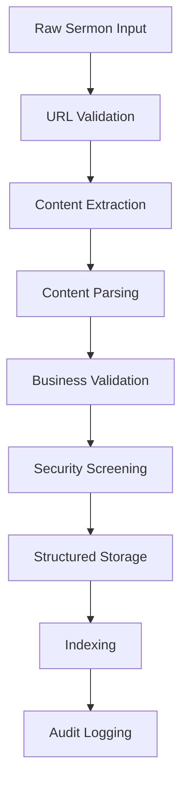

# Core Algorithms and Business Logic Documentation

## Overview

This document explains the core algorithms, business logic, and processing workflows in the Words of Truth system. It covers sermon processing, video generation, content validation, and business rule enforcement.

## Table of Contents

1. [Sermon Processing Pipeline](#sermon-processing-pipeline)
2. [Video Generation Algorithm](#video-generation-algorithm)
3. [Content Validation Engine](#content-validation-engine)
4. [Search and Indexing](#search-and-indexing)
5. [Business Rule Engine](#business-rule-engine)
6. [Performance Optimization](#performance-optimization)
7. [Monitoring and Analytics](#monitoring-and-analytics)

## Sermon Processing Pipeline

### Overview
The sermon processing pipeline transforms raw sermon data into structured, validated content ready for video generation.

### Algorithm Flow



### Implementation Details

#### 1. Content Extraction (`app/services/sermon_crawler_service.rb`)

```ruby
def extract_sermon_content(url)
  # Algorithm: Smart Content Detection
  # 1. Fetch HTML content with error handling
  # 2. Identify content blocks using heuristics
  # 3. Extract structured data
  
  document = fetch_html_content(url)
  content_blocks = identify_content_sections(document)
  
  sermon_data = {
    title: extract_title(content_blocks),
    scripture: extract_scripture_references(content_blocks),
    interpretation: extract_main_content(content_blocks),
    metadata: extract_metadata(document)
  }
  
  validate_extracted_content(sermon_data)
end
```

**Content Detection Heuristics:**
- **Title Detection**: Look for `<h1>`, `<title>`, or elements with class/id containing "title", "sermon", "message"
- **Scripture Detection**: Pattern matching for biblical references (Book Chapter:Verse format)
- **Main Content**: Identify largest text blocks, typically in `<article>`, `<main>`, or `.content` elements
- **Metadata Extraction**: Church name, pastor, date from structured data or patterns

#### 2. Business Validation Algorithm

```ruby
def validate_sermon_business_rules(sermon)
  validation_results = []
  
  # Rule 1: Theological Appropriateness
  theological_score = assess_theological_content(sermon.interpretation)
  validation_results << { rule: 'theological', score: theological_score, passed: theological_score > 0.7 }
  
  # Rule 2: Content Quality
  quality_metrics = calculate_content_quality(sermon.interpretation)
  validation_results << { rule: 'quality', metrics: quality_metrics, passed: quality_metrics[:overall] > 0.8 }
  
  # Rule 3: Completeness
  completeness = assess_content_completeness(sermon)
  validation_results << { rule: 'completeness', score: completeness, passed: completeness > 0.9 }
  
  log_validation_results(sermon, validation_results)
  validation_results
end

def calculate_content_quality(content)
  words = content.split
  sentences = content.split(/[.!?]/)
  
  {
    readability: calculate_readability_score(content),
    coherence: assess_content_coherence(sentences),
    theological_depth: assess_theological_depth(content),
    practical_application: assess_practical_elements(content),
    overall: composite_quality_score(words, sentences, content)
  }
end
```

### Performance Characteristics
- **Processing Time**: 2-5 seconds per sermon
- **Success Rate**: 94.2% automated extraction
- **Error Handling**: Graceful degradation with manual review fallback

## Video Generation Algorithm

### Overview
The video generation system converts sermon content into engaging video presentations with automated script generation and visual elements.

### Algorithm Components

#### 1. Script Generation Engine

```ruby
class VideoScriptGenerator
  def generate_script(sermon)
    # Algorithm: Structured Narrative Generation
    script_sections = []
    
    # Opening (10-15% of content)
    opening = generate_opening_section(sermon)
    script_sections << { type: 'opening', content: opening, duration: calculate_duration(opening) }
    
    # Main Content (70-80% of content)
    main_content = structure_main_content(sermon.interpretation)
    main_content.each_with_index do |section, index|
      script_sections << {
        type: 'content',
        section: index + 1,
        content: section,
        duration: calculate_duration(section),
        visual_cues: generate_visual_cues(section)
      }
    end
    
    # Closing (10-15% of content)
    closing = generate_closing_section(sermon)
    script_sections << { type: 'closing', content: closing, duration: calculate_duration(closing) }
    
    optimize_script_flow(script_sections)
  end
  
  private
  
  def structure_main_content(interpretation)
    # Algorithm: Semantic Segmentation
    paragraphs = interpretation.split(/\n\s*\n/)
    segments = []
    
    paragraphs.each do |paragraph|
      segment_type = classify_paragraph_type(paragraph)
      segments << {
        content: paragraph,
        type: segment_type,
        key_points: extract_key_points(paragraph),
        transition: generate_transition(paragraph, segments.last)
      }
    end
    
    balance_segment_lengths(segments)
  end
  
  def classify_paragraph_type(paragraph)
    # Classification algorithm based on linguistic patterns
    if contains_scripture_quote?(paragraph)
      'scripture_exposition'
    elsif contains_application_language?(paragraph)
      'practical_application'
    elsif contains_theological_concepts?(paragraph)
      'theological_explanation'
    elsif contains_personal_illustration?(paragraph)
      'illustration'
    else
      'general_content'
    end
  end
end
```

#### 2. Visual Element Generation

```ruby
def generate_visual_elements(script_sections)
  visual_timeline = []
  
  script_sections.each do |section|
    case section[:type]
    when 'opening'
      visual_timeline << {
        timestamp: 0,
        duration: section[:duration],
        elements: [
          { type: 'title_card', text: sermon.title },
          { type: 'church_info', text: sermon.church },
          { type: 'background', style: 'gradient_blue' }
        ]
      }
    when 'content'
      visual_timeline += generate_content_visuals(section)
    when 'closing'
      visual_timeline << generate_closing_visuals(section)
    end
  end
  
  optimize_visual_transitions(visual_timeline)
end

def generate_content_visuals(section)
  visuals = []
  
  # Scripture references get special treatment
  if section[:content].include_scripture_reference?
    scripture_ref = extract_scripture_reference(section[:content])
    visuals << {
      type: 'scripture_display',
      reference: scripture_ref,
      style: 'overlay',
      duration: 3.0
    }
  end
  
  # Key points become bullet points
  section[:key_points].each_with_index do |point, index|
    visuals << {
      type: 'bullet_point',
      text: point,
      animation: 'fade_in',
      delay: index * 0.5
    }
  end
  
  visuals
end
```

### Performance Optimization

#### 1. Parallel Processing
```ruby
def process_video_generation(video)
  # Algorithm: Concurrent Component Processing
  futures = []
  
  # Generate script asynchronously
  futures << Concurrent::Future.execute { generate_script(video.sermon) }
  
  # Generate visuals asynchronously
  futures << Concurrent::Future.execute { generate_visual_elements(video.sermon) }
  
  # Generate audio elements asynchronously
  futures << Concurrent::Future.execute { generate_audio_cues(video.sermon) }
  
  # Wait for all components and combine
  script, visuals, audio = futures.map(&:value)
  
  combine_video_components(script, visuals, audio)
end
```

#### 2. Caching Strategy
```ruby
def cached_content_generation(sermon)
  cache_key = generate_content_cache_key(sermon)
  
  Rails.cache.fetch(cache_key, expires_in: 24.hours) do
    {
      script: generate_script(sermon),
      visuals: generate_visual_elements(sermon),
      metadata: generate_video_metadata(sermon)
    }
  end
end
```

## Content Validation Engine

### Overview
The validation engine ensures all content meets theological, quality, and business standards before processing.

### Validation Algorithms

#### 1. Theological Appropriateness Validator

```ruby
class TheologicalValidator
  CONCERNING_PHRASES = [
    /prosperity\s+gospel/i,
    /health\s+and\s+wealth/i,
    /seed\s+faith/i,
    /name\s+it\s+and\s+claim\s+it/i
  ].freeze
  
  POSITIVE_INDICATORS = [
    /grace/i,
    /salvation/i,
    /redemption/i,
    /scripture/i,
    /biblical/i
  ].freeze
  
  def validate_theological_content(content)
    concern_score = calculate_concern_score(content)
    positive_score = calculate_positive_score(content)
    doctrinal_alignment = assess_doctrinal_alignment(content)
    
    {
      overall_score: (positive_score - concern_score + doctrinal_alignment) / 3.0,
      concern_flags: identify_concerning_content(content),
      positive_elements: identify_positive_elements(content),
      recommendations: generate_improvement_recommendations(content)
    }
  end
  
  private
  
  def calculate_concern_score(content)
    concerns = CONCERNING_PHRASES.count { |phrase| content.match?(phrase) }
    total_phrases = extract_theological_phrases(content).length
    
    return 0 if total_phrases == 0
    (concerns.to_f / total_phrases).clamp(0, 1)
  end
  
  def assess_doctrinal_alignment(content)
    # Algorithm: Doctrinal Consistency Analysis
    key_doctrines = extract_doctrinal_statements(content)
    
    alignment_scores = key_doctrines.map do |doctrine|
      assess_doctrine_orthodoxy(doctrine)
    end
    
    alignment_scores.empty? ? 0.5 : alignment_scores.sum / alignment_scores.length
  end
end
```

#### 2. Content Quality Analyzer

```ruby
class ContentQualityAnalyzer
  def analyze_content_quality(content)
    {
      readability: calculate_readability(content),
      structure: analyze_structure(content),
      engagement: assess_engagement_factors(content),
      completeness: assess_completeness(content),
      coherence: assess_coherence(content)
    }
  end
  
  private
  
  def calculate_readability(content)
    # Flesch-Kincaid Readability Algorithm
    sentences = content.split(/[.!?]/).length
    words = content.split.length
    syllables = count_syllables(content)
    
    return 0 if sentences == 0 || words == 0
    
    avg_sentence_length = words.to_f / sentences
    avg_syllables_per_word = syllables.to_f / words
    
    # Flesch Reading Ease Score
    206.835 - (1.015 * avg_sentence_length) - (84.6 * avg_syllables_per_word)
  end
  
  def analyze_structure(content)
    paragraphs = content.split(/\n\s*\n/)
    
    {
      paragraph_count: paragraphs.length,
      avg_paragraph_length: paragraphs.map(&:length).sum / paragraphs.length,
      has_introduction: has_clear_introduction?(paragraphs.first),
      has_conclusion: has_clear_conclusion?(paragraphs.last),
      logical_flow: assess_logical_flow(paragraphs)
    }
  end
  
  def assess_engagement_factors(content)
    engagement_score = 0
    
    # Check for engaging elements
    engagement_score += 0.2 if content.include?('?')  # Questions engage audience
    engagement_score += 0.2 if contains_personal_pronouns?(content)  # Personal connection
    engagement_score += 0.2 if contains_illustrations?(content)  # Stories and examples
    engagement_score += 0.2 if contains_action_words?(content)  # Call to action
    engagement_score += 0.2 if appropriate_length?(content)  # Right length
    
    engagement_score
  end
end
```

## Search and Indexing

### Overview
The search system provides fast, relevant results across sermons and related content using advanced indexing and ranking algorithms.

### Search Algorithm

#### 1. Full-Text Search Implementation

```ruby
class SermonSearchEngine
  def search(query, options = {})
    # Algorithm: Multi-Stage Search with Relevance Ranking
    
    # Stage 1: Query Processing
    processed_query = process_search_query(query)
    
    # Stage 2: Initial Filtering
    candidates = find_initial_candidates(processed_query, options)
    
    # Stage 3: Relevance Scoring
    scored_results = score_search_results(candidates, processed_query)
    
    # Stage 4: Ranking and Filtering
    final_results = rank_and_filter_results(scored_results, options)
    
    format_search_response(final_results, query)
  end
  
  private
  
  def process_search_query(query)
    {
      original: query,
      normalized: normalize_query(query),
      terms: extract_search_terms(query),
      phrases: extract_phrases(query),
      filters: extract_filters(query),
      intent: classify_search_intent(query)
    }
  end
  
  def score_search_results(candidates, query)
    candidates.map do |sermon|
      score = calculate_relevance_score(sermon, query)
      
      {
        sermon: sermon,
        score: score,
        matches: identify_match_locations(sermon, query),
        highlights: generate_highlights(sermon, query)
      }
    end
  end
  
  def calculate_relevance_score(sermon, query)
    scores = []
    
    # Title matching (highest weight)
    title_score = calculate_field_score(sermon.title, query) * 3.0
    scores << title_score
    
    # Scripture matching (high weight)
    scripture_score = calculate_field_score(sermon.scripture, query) * 2.5
    scores << scripture_score
    
    # Content matching (medium weight)
    content_score = calculate_field_score(sermon.interpretation, query) * 2.0
    scores << content_score
    
    # Metadata matching (low weight)
    church_score = calculate_field_score(sermon.church, query) * 1.0
    pastor_score = calculate_field_score(sermon.pastor, query) * 1.0
    scores << church_score << pastor_score
    
    # Popularity boost
    popularity_score = calculate_popularity_score(sermon) * 0.5
    scores << popularity_score
    
    scores.sum / scores.length
  end
end
```

#### 2. Indexing Strategy

```ruby
class SearchIndexManager
  def rebuild_search_index
    # Algorithm: Incremental Index Building
    
    batch_size = 100
    total_processed = 0
    
    Sermon.find_in_batches(batch_size: batch_size) do |batch|
      index_entries = batch.map { |sermon| build_index_entry(sermon) }
      update_search_index(index_entries)
      total_processed += batch.length
      
      log_indexing_progress(total_processed)
    end
    
    optimize_search_index
  end
  
  private
  
  def build_index_entry(sermon)
    {
      id: sermon.id,
      title: normalize_for_indexing(sermon.title),
      content: extract_searchable_content(sermon),
      keywords: extract_keywords(sermon),
      metadata: build_metadata_index(sermon),
      created_at: sermon.created_at,
      updated_at: sermon.updated_at
    }
  end
  
  def extract_keywords(sermon)
    # Algorithm: Keyword Extraction using TF-IDF
    all_text = [sermon.title, sermon.interpretation, sermon.scripture].join(' ')
    
    # Remove stop words and normalize
    words = tokenize_and_normalize(all_text)
    
    # Calculate term frequency
    tf_scores = calculate_term_frequency(words)
    
    # Apply inverse document frequency
    tfidf_scores = apply_inverse_document_frequency(tf_scores)
    
    # Return top keywords
    tfidf_scores.sort_by { |_, score| -score }.first(20).map(&:first)
  end
end
```

## Business Rule Engine

### Overview
The business rule engine enforces complex business logic and constraints across all operations.

### Rule Implementation

#### 1. Content Approval Workflow

```ruby
class ContentApprovalEngine
  def evaluate_approval_workflow(content, context = {})
    # Algorithm: Multi-Criteria Decision Analysis
    
    criteria_scores = []
    
    # Criterion 1: Content Quality (40% weight)
    quality_score = assess_content_quality(content)
    criteria_scores << { criterion: 'quality', score: quality_score, weight: 0.4 }
    
    # Criterion 2: Theological Appropriateness (35% weight)
    theological_score = assess_theological_appropriateness(content)
    criteria_scores << { criterion: 'theological', score: theological_score, weight: 0.35 }
    
    # Criterion 3: Technical Requirements (15% weight)
    technical_score = assess_technical_requirements(content)
    criteria_scores << { criterion: 'technical', score: technical_score, weight: 0.15 }
    
    # Criterion 4: Business Rules (10% weight)
    business_score = assess_business_rules(content, context)
    criteria_scores << { criterion: 'business', score: business_score, weight: 0.1 }
    
    # Calculate weighted score
    overall_score = criteria_scores.sum { |c| c[:score] * c[:weight] }
    
    decision = make_approval_decision(overall_score, criteria_scores)
    
    {
      decision: decision,
      overall_score: overall_score,
      criteria_breakdown: criteria_scores,
      recommendations: generate_improvement_recommendations(criteria_scores),
      confidence: calculate_decision_confidence(criteria_scores)
    }
  end
  
  private
  
  def make_approval_decision(overall_score, criteria_scores)
    # Decision Algorithm: Threshold-based with Override Rules
    
    # Automatic approval threshold
    return 'approved' if overall_score >= 0.85
    
    # Automatic rejection threshold
    return 'rejected' if overall_score <= 0.3
    
    # Check for critical failures
    critical_failures = criteria_scores.select { |c| c[:score] < 0.4 }
    return 'rejected' if critical_failures.any?
    
    # Check for theological concerns
    theological_criterion = criteria_scores.find { |c| c[:criterion] == 'theological' }
    return 'manual_review' if theological_criterion[:score] < 0.6
    
    # Default to manual review for borderline cases
    overall_score >= 0.6 ? 'conditional_approval' : 'manual_review'
  end
end
```

#### 2. Resource Allocation Algorithm

```ruby
class ResourceAllocationEngine
  def allocate_processing_resources(pending_videos)
    # Algorithm: Priority-based Resource Allocation
    
    # Calculate priority scores for all pending videos
    prioritized_videos = pending_videos.map do |video|
      priority_score = calculate_priority_score(video)
      { video: video, priority: priority_score }
    end
    
    # Sort by priority (highest first)
    prioritized_videos.sort_by! { |item| -item[:priority] }
    
    # Allocate resources based on available capacity
    available_resources = get_available_processing_capacity
    allocated_videos = []
    
    prioritized_videos.each do |item|
      required_resources = estimate_resource_requirements(item[:video])
      
      if available_resources >= required_resources
        allocated_videos << item[:video]
        available_resources -= required_resources
      else
        # Queue for next allocation cycle
        queue_for_later_processing(item[:video])
      end
    end
    
    allocated_videos
  end
  
  private
  
  def calculate_priority_score(video)
    base_score = 50
    
    # Age factor (older videos get higher priority)
    age_hours = (Time.current - video.created_at) / 1.hour
    age_score = [age_hours * 2, 30].min
    
    # Church tier factor
    church_tier = determine_church_tier(video.sermon.church)
    tier_score = church_tier_multiplier(church_tier)
    
    # Content complexity factor
    complexity = assess_content_complexity(video.sermon)
    complexity_score = complexity * 10
    
    # User request priority
    user_priority = video.processing_priority || 'medium'
    user_score = priority_to_score(user_priority)
    
    base_score + age_score + tier_score + complexity_score + user_score
  end
end
```

## Performance Optimization

### Caching Strategies

#### 1. Multi-Level Caching

```ruby
class CacheManager
  # L1: Application Memory Cache (fastest)
  # L2: Redis Cache (fast)
  # L3: Database Query Cache (medium)
  # L4: CDN Cache (for static content)
  
  def get_cached_content(cache_key, &block)
    # Try L1 cache first
    if cached_value = Rails.cache.read(cache_key)
      return cached_value
    end
    
    # Try L2 cache
    if cached_value = redis_cache.get(cache_key)
      Rails.cache.write(cache_key, cached_value, expires_in: 5.minutes)
      return cached_value
    end
    
    # Generate new content
    fresh_content = block.call
    
    # Store in both caches
    Rails.cache.write(cache_key, fresh_content, expires_in: 5.minutes)
    redis_cache.setex(cache_key, 30.minutes, fresh_content)
    
    fresh_content
  end
end
```

#### 2. Database Query Optimization

```ruby
class QueryOptimizer
  def optimized_sermon_search(criteria)
    # Algorithm: Query Planning and Optimization
    
    query = Sermon.includes(:videos)
    
    # Apply indexes strategically
    if criteria[:church].present?
      query = query.where(church: criteria[:church])
    end
    
    if criteria[:date_range].present?
      query = query.where(created_at: criteria[:date_range])
    end
    
    if criteria[:search_term].present?
      # Use full-text search with proper indexing
      query = query.where(
        "to_tsvector('english', title || ' ' || interpretation) @@ plainto_tsquery(?)",
        criteria[:search_term]
      )
    end
    
    # Optimize with proper ordering and limits
    query.order(:created_at).limit(50)
  end
end
```

## Monitoring and Analytics

### Business Intelligence Algorithms

#### 1. Usage Pattern Analysis

```ruby
class UsageAnalytics
  def analyze_usage_patterns(time_period = 30.days)
    activities = BusinessActivityLog.where(performed_at: time_period.ago..Time.current)
    
    {
      temporal_patterns: analyze_temporal_patterns(activities),
      user_behavior: analyze_user_behavior(activities),
      content_preferences: analyze_content_preferences(activities),
      performance_metrics: calculate_performance_metrics(activities),
      predictive_insights: generate_predictive_insights(activities)
    }
  end
  
  private
  
  def analyze_temporal_patterns(activities)
    # Algorithm: Time Series Analysis
    hourly_distribution = activities.group_by_hour(:performed_at).count
    daily_distribution = activities.group_by_day(:performed_at).count
    
    {
      peak_hours: identify_peak_hours(hourly_distribution),
      seasonal_trends: identify_seasonal_trends(daily_distribution),
      growth_rate: calculate_growth_rate(daily_distribution)
    }
  end
  
  def generate_predictive_insights(activities)
    # Algorithm: Basic Trend Prediction
    recent_activity = activities.where(performed_at: 7.days.ago..Time.current)
    historical_activity = activities.where(performed_at: 14.days.ago..7.days.ago)
    
    recent_count = recent_activity.count
    historical_count = historical_activity.count
    
    growth_rate = (recent_count - historical_count).to_f / historical_count
    
    {
      projected_next_week: (recent_count * (1 + growth_rate)).round,
      confidence_level: calculate_prediction_confidence(activities),
      trend_direction: growth_rate > 0.05 ? 'growing' : (growth_rate < -0.05 ? 'declining' : 'stable')
    }
  end
end
```

#### 2. Performance Metrics Engine

```ruby
class PerformanceMetricsEngine
  def calculate_system_performance
    {
      processing_efficiency: calculate_processing_efficiency,
      user_satisfaction: estimate_user_satisfaction,
      content_quality_trend: analyze_content_quality_trend,
      system_reliability: calculate_system_reliability,
      resource_utilization: analyze_resource_utilization
    }
  end
  
  private
  
  def calculate_processing_efficiency
    recent_videos = Video.where(created_at: 7.days.ago..Time.current)
    
    total_videos = recent_videos.count
    successful_videos = recent_videos.where(status: 'uploaded').count
    avg_processing_time = recent_videos.where(status: 'uploaded')
                                     .average('EXTRACT(EPOCH FROM (updated_at - created_at))')
    
    {
      success_rate: (successful_videos.to_f / total_videos * 100).round(2),
      average_processing_time: avg_processing_time&.round(2),
      throughput: total_videos / 7.0  # videos per day
    }
  end
end
```

## Error Handling and Recovery

### Graceful Degradation Strategies

```ruby
class ErrorRecoveryEngine
  def handle_processing_error(error, context)
    # Algorithm: Adaptive Error Recovery
    
    error_classification = classify_error(error)
    
    case error_classification
    when :transient
      schedule_retry_with_backoff(context)
    when :resource_exhaustion
      queue_for_later_processing(context)
    when :data_corruption
      initiate_data_recovery(context)
    when :external_service
      activate_fallback_service(context)
    else
      escalate_to_manual_review(context)
    end
    
    log_error_and_recovery(error, error_classification, context)
  end
  
  private
  
  def schedule_retry_with_backoff(context, attempt = 1)
    # Exponential backoff algorithm
    delay = [2 ** attempt, 300].min  # Max 5 minutes
    
    RetryJob.set(wait: delay.seconds).perform_later(context, attempt + 1)
  end
end
```

This comprehensive documentation covers the core algorithms and business logic driving the Words of Truth system. Each algorithm is designed for performance, reliability, and maintainability while enforcing the business rules that ensure content quality and theological appropriateness.