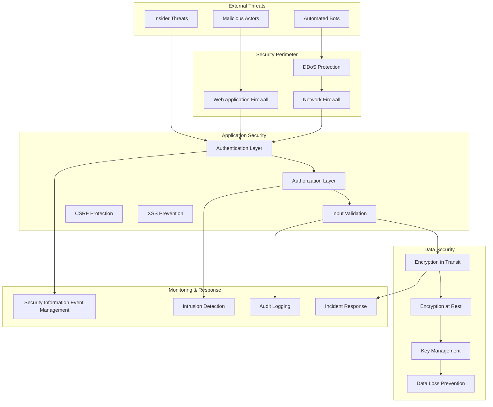

# Security and Compliance Documentation

## Overview

This document outlines the comprehensive security measures and compliance procedures implemented in the Words of Truth system to protect sensitive data, ensure regulatory compliance, and maintain the highest standards of information security.

## Table of Contents

1. [Security Framework](#security-framework)
2. [Authentication & Authorization](#authentication--authorization)
3. [Data Protection & Encryption](#data-protection--encryption)
4. [Network Security](#network-security)
5. [Application Security](#application-security)
6. [Compliance Requirements](#compliance-requirements)
7. [Incident Response](#incident-response)
8. [Security Monitoring](#security-monitoring)
9. [Regular Security Procedures](#regular-security-procedures)
10. [Security Training & Awareness](#security-training--awareness)

## Security Framework

### Security Principles

The Words of Truth system implements security based on these core principles:

1. **Defense in Depth**: Multiple layers of security controls
2. **Principle of Least Privilege**: Minimal necessary access rights
3. **Zero Trust Architecture**: Never trust, always verify
4. **Security by Design**: Built-in security from the ground up
5. **Continuous Monitoring**: Real-time threat detection and response
6. **Data Classification**: Appropriate protection based on sensitivity
7. **Compliance First**: Meeting all regulatory requirements

### Security Architecture Overview



## Authentication & Authorization

### Multi-Factor Authentication (MFA)

```ruby
# Enhanced authentication system
class AuthenticationService
  include SecurityLogging
  
  MAX_LOGIN_ATTEMPTS = 5
  LOCKOUT_DURATION = 30.minutes
  
  def authenticate(email, password, mfa_token = nil, request_info = {})
    # Rate limiting check
    return rate_limit_response if rate_limited?(email, request_info[:ip])
    
    # Find user and validate password
    user = User.find_by(email: email.downcase)
    unless user&.authenticate(password)
      handle_failed_login(email, request_info)
      return authentication_failure_response
    end
    
    # Check account status
    return account_locked_response if user.account_locked?
    return account_suspended_response if user.account_suspended?
    
    # MFA verification
    if user.mfa_enabled?
      unless verify_mfa_token(user, mfa_token)
        log_security_event('mfa_failure', user, request_info)
        return mfa_failure_response
      end
    end
    
    # Successful authentication
    handle_successful_login(user, request_info)
    generate_session_token(user, request_info)
  end
  
  private
  
  def verify_mfa_token(user, token)
    return false if token.blank?
    
    # Time-based OTP verification
    totp = ROTP::TOTP.new(user.mfa_secret)
    valid = totp.verify(token, drift_behind: 30, drift_ahead: 30)
    
    # Backup codes verification if TOTP fails
    unless valid
      valid = user.verify_backup_code(token)
    end
    
    log_security_event('mfa_verification', user, { 
      success: valid, 
      method: valid ? 'totp' : 'backup_code' 
    })
    
    valid
  end
  
  def rate_limited?(email, ip)
    key = "login_attempts:#{email}:#{ip}"
    attempts = Redis.current.get(key).to_i
    attempts >= MAX_LOGIN_ATTEMPTS
  end
  
  def handle_failed_login(email, request_info)
    # Increment failed login counter
    key = "login_attempts:#{email}:#{request_info[:ip]}"
    Redis.current.incr(key)
    Redis.current.expire(key, LOCKOUT_DURATION)
    
    # Log security event
    log_security_event('failed_login', nil, {
      email: email,
      ip: request_info[:ip],
      user_agent: request_info[:user_agent],
      timestamp: Time.current
    })
    
    # Check for brute force patterns
    check_brute_force_pattern(email, request_info[:ip])
  end
end
```

### Role-Based Access Control (RBAC)

```ruby
class AuthorizationService
  include SecurityLogging
  
  # Define role hierarchy
  ROLE_HIERARCHY = {
    'system_admin' => %w[manage_all view_all edit_all delete_all admin_panel],
    'admin' => %w[manage_users manage_content view_all edit_all delete_content],
    'moderator' => %w[moderate_content edit_content view_content flag_content],
    'editor' => %w[create_content edit_own_content view_content],
    'user' => %w[view_public_content create_basic_content],
    'viewer' => %w[view_public_content]
  }.freeze
  
  # Resource-based permissions
  RESOURCE_PERMISSIONS = {
    'Sermon' => {
      'create' => %w[admin editor],
      'read' => %w[admin moderator editor user viewer],
      'update' => %w[admin moderator editor],
      'delete' => %w[admin moderator],
      'approve' => %w[admin moderator],
      'publish' => %w[admin moderator]
    },
    'Video' => {
      'create' => %w[admin editor],
      'read' => %w[admin moderator editor user],
      'update' => %w[admin moderator],
      'delete' => %w[admin],
      'process' => %w[admin],
      'upload' => %w[admin]
    }
  }.freeze
  
  def authorize(user, action, resource = nil)
    return false unless user&.active?
    
    # System admin has all permissions
    return true if user.role == 'system_admin'
    
    # Check resource-specific permissions
    if resource
      permitted = check_resource_permission(user, action, resource)
    else
      permitted = check_general_permission(user, action)
    end
    
    # Log authorization attempt
    log_authorization_attempt(user, action, resource, permitted)
    
    permitted
  end
  
  private
  
  def check_resource_permission(user, action, resource)
    resource_type = resource.class.name
    permissions = RESOURCE_PERMISSIONS[resource_type]
    
    return false unless permissions
    
    allowed_roles = permissions[action.to_s] || []
    role_permitted = allowed_roles.include?(user.role)
    
    # Check ownership for certain actions
    if action.to_s.include?('own') && resource.respond_to?(:user_id)
      role_permitted && resource.user_id == user.id
    else
      role_permitted
    end
  end
  
  def check_general_permission(user, action)
    user_permissions = ROLE_HIERARCHY[user.role] || []
    user_permissions.include?(action.to_s)
  end
  
  def log_authorization_attempt(user, action, resource, permitted)
    log_security_event('authorization_attempt', user, {
      action: action,
      resource_type: resource&.class&.name,
      resource_id: resource&.id,
      permitted: permitted,
      timestamp: Time.current
    })
  end
end
```

### Session Management

```ruby
class SessionManager
  include SecurityLogging
  
  SESSION_TIMEOUT = 24.hours
  IDLE_TIMEOUT = 2.hours
  MAX_CONCURRENT_SESSIONS = 3
  
  def create_session(user, request_info = {})
    # Invalidate old sessions if limit exceeded
    enforce_session_limit(user)
    
    # Generate secure session token
    session_token = SecureRandom.urlsafe_base64(32)
    
    # Create session record
    session = UserSession.create!(
      user: user,
      session_token: session_token,
      ip_address: request_info[:ip],
      user_agent: request_info[:user_agent],
      created_at: Time.current,
      last_activity_at: Time.current,
      expires_at: SESSION_TIMEOUT.from_now
    )
    
    # Store session in Redis for fast lookup
    store_session_in_cache(session)
    
    log_security_event('session_created', user, {
      session_id: session.id,
      ip_address: request_info[:ip]
    })
    
    session_token
  end
  
  def validate_session(session_token)
    return nil if session_token.blank?
    
    # Check cache first
    session_data = Redis.current.get("session:#{session_token}")
    if session_data
      session = JSON.parse(session_data)
      return nil if session_expired?(session)
      
      # Update last activity
      update_session_activity(session_token)
      return session
    end
    
    # Fallback to database
    session = UserSession.find_by(session_token: session_token)
    return nil unless session&.active?
    
    # Update activity and cache
    session.update!(last_activity_at: Time.current)
    store_session_in_cache(session)
    
    session
  end
  
  def invalidate_session(session_token)
    # Remove from cache
    Redis.current.del("session:#{session_token}")
    
    # Mark as inactive in database
    session = UserSession.find_by(session_token: session_token)
    if session
      session.update!(active: false, ended_at: Time.current)
      log_security_event('session_ended', session.user, {
        session_id: session.id,
        reason: 'manual_logout'
      })
    end
  end
  
  private
  
  def enforce_session_limit(user)
    active_sessions = user.user_sessions.active.order(:created_at)
    
    if active_sessions.count >= MAX_CONCURRENT_SESSIONS
      # Invalidate oldest sessions
      sessions_to_remove = active_sessions.limit(active_sessions.count - MAX_CONCURRENT_SESSIONS + 1)
      sessions_to_remove.each do |session|
        invalidate_session(session.session_token)
      end
    end
  end
  
  def session_expired?(session)
    session_time = Time.parse(session['last_activity_at'])
    idle_expired = session_time < IDLE_TIMEOUT.ago
    absolute_expired = Time.parse(session['expires_at']) < Time.current
    
    idle_expired || absolute_expired
  end
end
```

## Data Protection & Encryption

### Encryption Strategy

```ruby
# Comprehensive encryption implementation
class EncryptionService
  include SecurityLogging
  
  # Encryption algorithms and key sizes
  ENCRYPTION_ALGORITHM = 'aes-256-gcm'.freeze
  KEY_SIZE = 32 # 256 bits
  IV_SIZE = 12  # 96 bits for GCM
  TAG_SIZE = 16 # 128 bits for GCM
  
  # Key derivation settings
  PBKDF2_ITERATIONS = 100_000
  SALT_SIZE = 32
  
  def self.encrypt_sensitive_data(data, context = {})
    return nil if data.blank?
    
    begin
      # Generate encryption key for context
      key = derive_encryption_key(context)
      
      # Initialize cipher
      cipher = OpenSSL::Cipher.new(ENCRYPTION_ALGORITHM)
      cipher.encrypt
      cipher.key = key
      
      # Generate random IV
      iv = cipher.random_iv
      
      # Encrypt data
      encrypted = cipher.update(data) + cipher.final
      auth_tag = cipher.auth_tag
      
      # Combine IV + auth_tag + encrypted_data
      combined = iv + auth_tag + encrypted
      
      # Base64 encode for storage
      encoded = Base64.strict_encode64(combined)
      
      # Log encryption event
      log_encryption_event('encrypt', context)
      
      encoded
    rescue => e
      log_encryption_error('encrypt', e, context)
      raise EncryptionError, "Failed to encrypt data: #{e.message}"
    end
  end
  
  def self.decrypt_sensitive_data(encrypted_data, context = {})
    return nil if encrypted_data.blank?
    
    begin
      # Decode from Base64
      combined = Base64.strict_decode64(encrypted_data)
      
      # Extract components
      iv = combined[0, IV_SIZE]
      auth_tag = combined[IV_SIZE, TAG_SIZE]
      encrypted = combined[IV_SIZE + TAG_SIZE..-1]
      
      # Generate decryption key
      key = derive_encryption_key(context)
      
      # Initialize cipher for decryption
      decipher = OpenSSL::Cipher.new(ENCRYPTION_ALGORITHM)
      decipher.decrypt
      decipher.key = key
      decipher.iv = iv
      decipher.auth_tag = auth_tag
      
      # Decrypt data
      decrypted = decipher.update(encrypted) + decipher.final
      
      # Log decryption event
      log_encryption_event('decrypt', context)
      
      decrypted
    rescue => e
      log_encryption_error('decrypt', e, context)
      raise DecryptionError, "Failed to decrypt data: #{e.message}"
    end
  end
  
  private
  
  def self.derive_encryption_key(context = {})
    # Base key from Rails credentials
    base_key = Rails.application.credentials.secret_key_base
    
    # Context-specific salt
    context_string = context.sort.to_h.to_json
    salt = OpenSSL::Digest::SHA256.digest("wordsoftruth_salt_#{context_string}")
    
    # Derive key using PBKDF2
    OpenSSL::PKCS5.pbkdf2_hmac_sha256(
      base_key,
      salt,
      PBKDF2_ITERATIONS,
      KEY_SIZE
    )
  end
  
  def self.log_encryption_event(operation, context)
    BusinessActivityLog.create!(
      activity_type: 'encryption_event',
      entity_type: context[:entity_type],
      entity_id: context[:entity_id],
      context: {
        operation: operation,
        algorithm: ENCRYPTION_ALGORITHM,
        timestamp: Time.current.iso8601
      },
      performed_at: Time.current
    )
  rescue => e
    Rails.logger.error "Failed to log encryption event: #{e.message}"
  end
end
```

### Key Management

```ruby
class KeyManagementService
  include SecurityLogging
  
  # Key rotation schedule
  KEY_ROTATION_INTERVAL = 90.days
  KEY_RETENTION_PERIOD = 1.year
  
  def self.rotate_encryption_keys
    log_security_event('key_rotation_started', nil, {
      timestamp: Time.current,
      previous_key_id: current_key_id
    })
    
    begin
      # Generate new encryption key
      new_key = generate_new_encryption_key
      
      # Update key in secure storage
      store_encryption_key(new_key)
      
      # Schedule data re-encryption
      schedule_data_reencryption(current_key_id, new_key[:id])
      
      # Archive old key
      archive_old_key(current_key_id)
      
      log_security_event('key_rotation_completed', nil, {
        new_key_id: new_key[:id],
        timestamp: Time.current
      })
      
      new_key
    rescue => e
      log_security_event('key_rotation_failed', nil, {
        error: e.message,
        timestamp: Time.current
      })
      raise
    end
  end
  
  def self.validate_key_integrity
    current_key = retrieve_current_key
    
    # Verify key exists and is accessible
    raise KeyValidationError, "Current key not found" unless current_key
    
    # Test encryption/decryption with current key
    test_data = "integrity_test_#{SecureRandom.hex(16)}"
    encrypted = EncryptionService.encrypt_sensitive_data(test_data)
    decrypted = EncryptionService.decrypt_sensitive_data(encrypted)
    
    unless test_data == decrypted
      raise KeyValidationError, "Key integrity check failed"
    end
    
    # Check key age and schedule rotation if needed
    key_age = Time.current - current_key[:created_at]
    if key_age > KEY_ROTATION_INTERVAL
      KeyRotationJob.perform_later
    end
    
    true
  end
  
  private
  
  def self.generate_new_encryption_key
    {
      id: SecureRandom.uuid,
      key_material: SecureRandom.random_bytes(32),
      algorithm: 'aes-256-gcm',
      created_at: Time.current,
      status: 'active'
    }
  end
  
  def self.store_encryption_key(key)
    # Store in AWS KMS or HashiCorp Vault
    kms_client = Aws::KMS::Client.new
    
    response = kms_client.create_key({
      description: "Words of Truth encryption key #{key[:id]}",
      usage: 'ENCRYPT_DECRYPT',
      key_spec: 'SYMMETRIC_DEFAULT'
    })
    
    # Store key metadata in secure configuration
    Rails.application.credentials.encryption_keys ||= {}
    Rails.application.credentials.encryption_keys[key[:id]] = {
      kms_key_id: response.key_metadata.key_id,
      created_at: key[:created_at],
      algorithm: key[:algorithm]
    }
  end
end
```

## Network Security

### Firewall Configuration

```bash
#!/bin/bash
# Comprehensive firewall setup

echo "Configuring network security..."

# Default policies - deny all
ufw --force reset
ufw default deny incoming
ufw default deny outgoing
ufw default deny forward

# Allow essential outgoing connections
ufw allow out 53/udp     # DNS
ufw allow out 80/tcp     # HTTP
ufw allow out 443/tcp    # HTTPS
ufw allow out 25/tcp     # SMTP
ufw allow out 587/tcp    # SMTP TLS
ufw allow out 993/tcp    # IMAP SSL

# SSH access (restricted to management network)
ufw allow from 10.0.1.0/24 to any port 22

# Web traffic
ufw allow 80/tcp
ufw allow 443/tcp

# Application specific ports
ufw allow from 10.0.0.0/16 to any port 3000  # Rails app
ufw allow from 10.0.0.0/16 to any port 6379  # Redis
ufw allow from 10.0.0.0/16 to any port 5432  # PostgreSQL

# Monitoring and logging
ufw allow from 10.0.2.0/24 to any port 9090  # Prometheus
ufw allow from 10.0.2.0/24 to any port 3001  # Grafana

# Rate limiting for HTTP/HTTPS
ufw limit 80/tcp
ufw limit 443/tcp

# Enable logging
ufw logging on

# Enable firewall
ufw --force enable

echo "Firewall configuration completed"
```

### Network Intrusion Detection

```ruby
class NetworkSecurityMonitor
  include SecurityLogging
  
  # Suspicious activity patterns
  SUSPICIOUS_PATTERNS = {
    port_scan: /multiple port access from same IP/,
    sql_injection: /union select|drop table|insert into/i,
    xss_attempt: /<script|javascript:|onload=/i,
    brute_force: /failed login from same IP > 10 times/,
    directory_traversal: /\.\.\/|\.\.\\|\/etc\/passwd/,
    command_injection: /;|\||&|`|\$\(/
  }.freeze
  
  def self.monitor_network_traffic
    Thread.new do
      loop do
        analyze_access_logs
        check_connection_patterns
        detect_anomalies
        sleep 60
      end
    end
  end
  
  def self.analyze_access_logs
    recent_logs = parse_access_logs(5.minutes.ago)
    
    recent_logs.each do |log_entry|
      check_suspicious_patterns(log_entry)
      check_rate_limits(log_entry)
      check_geo_restrictions(log_entry)
    end
  end
  
  private
  
  def self.check_suspicious_patterns(log_entry)
    SUSPICIOUS_PATTERNS.each do |pattern_name, pattern|
      if log_entry[:request].match?(pattern) || log_entry[:user_agent].match?(pattern)
        create_security_alert(pattern_name, log_entry)
      end
    end
  end
  
  def self.check_rate_limits(log_entry)
    ip = log_entry[:ip]
    timeframe = 1.minute
    
    # Count requests from this IP in the last minute
    request_count = count_requests_from_ip(ip, timeframe)
    
    if request_count > 100 # Threshold for rate limiting
      block_ip_temporarily(ip, 15.minutes)
      create_security_alert(:rate_limit_exceeded, log_entry.merge(request_count: request_count))
    end
  end
  
  def self.create_security_alert(alert_type, log_entry)
    SecurityAlert.create!(
      alert_type: alert_type,
      severity: calculate_severity(alert_type),
      source_ip: log_entry[:ip],
      details: log_entry,
      created_at: Time.current,
      status: 'open'
    )
    
    # Notify security team for high-severity alerts
    if calculate_severity(alert_type) >= 'high'
      SecurityNotificationMailer.immediate_alert(alert_type, log_entry).deliver_now
    end
  end
end
```

## Application Security

### Input Validation and Sanitization

```ruby
class SecurityValidator < ActiveModel::EachValidator
  include SecurityLogging
  
  # Security validation rules
  SECURITY_RULES = {
    content: {
      max_length: 10_000,
      forbidden_patterns: [
        /<script[^>]*>/i,              # Script tags
        /javascript:/i,                # JavaScript protocol
        /data:text\/html/i,            # Data URLs
        /vbscript:/i,                  # VBScript
        /on\w+\s*=/i,                  # Event handlers
        /expression\s*\(/i,            # CSS expressions
        /url\s*\(/i,                   # CSS URLs
        /import\s+/i                   # CSS imports
      ],
      required_encoding: 'UTF-8'
    },
    
    url: {
      allowed_schemes: %w[http https],
      max_length: 2000,
      forbidden_hosts: %w[
        127.0.0.1 localhost 10.0.0.0/8 172.16.0.0/12 192.168.0.0/16
      ]
    },
    
    scripture_reference: {
      format: /\A\d*\s*[A-Za-z]+(?:\s+\d+)?(?::\d+(?:-\d+)?)?\z/,
      max_length: 200
    }
  }.freeze
  
  def validate_each(record, attribute, value)
    return if value.blank?
    
    security_type = options[:type] || :content
    rules = SECURITY_RULES[security_type]
    
    return unless rules
    
    # Validate length
    if rules[:max_length] && value.length > rules[:max_length]
      record.errors.add(attribute, "exceeds maximum length of #{rules[:max_length]} characters")
      log_security_violation(:length_exceeded, record, attribute, value)
    end
    
    # Check forbidden patterns
    if rules[:forbidden_patterns]
      rules[:forbidden_patterns].each do |pattern|
        if value.match?(pattern)
          record.errors.add(attribute, "contains potentially dangerous content")
          log_security_violation(:forbidden_pattern, record, attribute, pattern)
          break
        end
      end
    end
    
    # Validate URL-specific rules
    if security_type == :url
      validate_url_security(record, attribute, value, rules)
    end
    
    # Validate encoding
    if rules[:required_encoding]
      unless value.encoding.name == rules[:required_encoding]
        record.errors.add(attribute, "must be in #{rules[:required_encoding]} encoding")
        log_security_violation(:invalid_encoding, record, attribute, value.encoding.name)
      end
    end
  end
  
  private
  
  def validate_url_security(record, attribute, value, rules)
    begin
      uri = URI.parse(value)
      
      # Check scheme
      unless rules[:allowed_schemes].include?(uri.scheme)
        record.errors.add(attribute, "uses forbidden protocol: #{uri.scheme}")
        log_security_violation(:forbidden_scheme, record, attribute, uri.scheme)
      end
      
      # Check for forbidden hosts (prevent SSRF)
      if rules[:forbidden_hosts].any? { |host| uri.host&.include?(host) }
        record.errors.add(attribute, "targets forbidden host")
        log_security_violation(:forbidden_host, record, attribute, uri.host)
      end
      
    rescue URI::InvalidURIError
      record.errors.add(attribute, "is not a valid URL")
      log_security_violation(:invalid_url, record, attribute, value)
    end
  end
  
  def log_security_violation(violation_type, record, attribute, details)
    BusinessActivityLog.create!(
      activity_type: 'security_violation',
      entity_type: record.class.name,
      entity_id: record.id,
      context: {
        violation_type: violation_type,
        attribute: attribute,
        details: details,
        timestamp: Time.current.iso8601
      },
      performed_at: Time.current
    )
  rescue => e
    Rails.logger.error "Failed to log security violation: #{e.message}"
  end
end
```

### CSRF Protection

```ruby
class SecurityController < ApplicationController
  protect_from_forgery with: :exception, prepend: true
  
  # Enhanced CSRF protection
  before_action :verify_authenticity_token
  before_action :validate_csrf_token_freshness
  before_action :check_request_origin
  
  private
  
  def verify_authenticity_token
    super
  rescue ActionController::InvalidAuthenticityToken => e
    log_security_event('csrf_token_invalid', current_user, {
      request_path: request.path,
      ip_address: request.remote_ip,
      user_agent: request.user_agent,
      referer: request.referer
    })
    
    render json: { error: 'Invalid CSRF token' }, status: :forbidden
  end
  
  def validate_csrf_token_freshness
    token_timestamp = session[:csrf_token_timestamp]
    
    if token_timestamp && token_timestamp < 1.hour.ago
      reset_csrf_token
      log_security_event('csrf_token_expired', current_user, {
        token_age: Time.current - token_timestamp
      })
    end
  end
  
  def check_request_origin
    return unless request.post? || request.patch? || request.put? || request.delete?
    
    origin = request.headers['Origin']
    referer = request.headers['Referer']
    
    allowed_origins = [
      'https://wordsoftruth.com',
      'https://www.wordsoftruth.com'
    ]
    
    unless origin_allowed?(origin, allowed_origins) || referer_allowed?(referer, allowed_origins)
      log_security_event('suspicious_origin', current_user, {
        origin: origin,
        referer: referer,
        request_path: request.path
      })
      
      render json: { error: 'Request origin not allowed' }, status: :forbidden
    end
  end
  
  def reset_csrf_token
    session[:_csrf_token] = nil
    session[:csrf_token_timestamp] = Time.current
  end
end
```

## Compliance Requirements

### GDPR Compliance Implementation

```ruby
module GDPRCompliance
  extend ActiveSupport::Concern
  
  included do
    # Data retention policies
    scope :expired_personal_data, -> { where('created_at < ?', 7.years.ago) }
    scope :pending_deletion, -> { where(deletion_requested_at: ..30.days.ago) }
    
    # GDPR-required callbacks
    before_destroy :log_data_deletion
    after_update :log_data_modification
  end
  
  class_methods do
    def setup_gdpr_compliance
      # Define personal data fields
      define_personal_data_fields
      
      # Set up automatic data retention
      setup_data_retention_policy
      
      # Configure consent management
      setup_consent_management
    end
    
    private
    
    def define_personal_data_fields
      @personal_data_fields = []
      
      # Scan for fields that contain personal data
      columns.each do |column|
        if personal_data_field?(column.name)
          @personal_data_fields << column.name
          
          # Add encryption if not already present
          attr_encrypted column.name.to_sym, key: :encryption_key unless encrypted_attributes.key?(column.name.to_sym)
        end
      end
    end
    
    def personal_data_field?(field_name)
      personal_indicators = %w[email phone name address ip_address user_agent]
      personal_indicators.any? { |indicator| field_name.include?(indicator) }
    end
  end
  
  # Data subject rights implementation
  def export_personal_data
    personal_data = {}
    
    self.class.personal_data_fields.each do |field|
      value = send(field)
      personal_data[field] = value if value.present?
    end
    
    # Include related data
    personal_data[:activities] = export_activity_data
    personal_data[:consents] = export_consent_data
    
    # Log data export
    log_gdpr_activity('data_export', personal_data.keys)
    
    personal_data
  end
  
  def anonymize_personal_data
    anonymization_mapping = {}
    
    self.class.personal_data_fields.each do |field|
      original_value = send(field)
      next unless original_value.present?
      
      anonymized_value = anonymize_field(field, original_value)
      send("#{field}=", anonymized_value)
      
      anonymization_mapping[field] = {
        original_hash: Digest::SHA256.hexdigest(original_value.to_s),
        anonymized_value: anonymized_value
      }
    end
    
    # Mark as anonymized
    self.anonymized_at = Time.current
    save!
    
    # Log anonymization
    log_gdpr_activity('data_anonymization', anonymization_mapping)
    
    anonymization_mapping
  end
  
  def request_data_deletion
    self.deletion_requested_at = Time.current
    save!
    
    # Schedule actual deletion after grace period
    DataDeletionJob.set(wait: 30.days).perform_later(self.class.name, id)
    
    log_gdpr_activity('deletion_requested')
  end
  
  private
  
  def anonymize_field(field_name, value)
    case field_name
    when /email/
      "anonymized_#{SecureRandom.hex(8)}@example.com"
    when /name/
      "Anonymized User #{SecureRandom.hex(4)}"
    when /phone/
      "+1-555-#{SecureRandom.random_number(1000000).to_s.rjust(7, '0')}"
    when /ip_address/
      "192.0.2.#{SecureRandom.random_number(255)}" # RFC5737 test address
    else
      "anonymized_#{SecureRandom.hex(8)}"
    end
  end
  
  def log_gdpr_activity(activity_type, details = {})
    BusinessActivityLog.create!(
      activity_type: 'gdpr_compliance',
      entity_type: self.class.name,
      entity_id: id,
      context: {
        gdpr_activity: activity_type,
        details: details,
        timestamp: Time.current.iso8601,
        compliance_officer: 'system'
      },
      performed_at: Time.current
    )
  end
end
```

### SOC 2 Compliance

```ruby
class SOC2ComplianceMonitor
  include SecurityLogging
  
  # SOC 2 Trust Service Criteria
  TRUST_CRITERIA = {
    security: %w[access_controls encryption monitoring incident_response],
    availability: %w[system_availability performance_monitoring capacity_planning],
    processing_integrity: %w[data_validation error_handling quality_assurance],
    confidentiality: %w[data_classification access_restrictions confidentiality_agreements],
    privacy: %w[personal_data_handling consent_management data_retention]
  }.freeze
  
  def self.generate_compliance_report(period = 1.month)
    report = {
      period: { start: period.ago, end: Time.current },
      criteria_assessment: {},
      evidence_collection: {},
      exceptions: [],
      remediation_actions: []
    }
    
    TRUST_CRITERIA.each do |criteria, controls|
      report[:criteria_assessment][criteria] = assess_criteria_compliance(criteria, controls, period)
    end
    
    # Collect evidence for audit
    report[:evidence_collection] = collect_audit_evidence(period)
    
    # Identify exceptions and remediation
    report[:exceptions] = identify_compliance_exceptions(period)
    report[:remediation_actions] = generate_remediation_plan(report[:exceptions])
    
    # Store report for audit trail
    store_compliance_report(report)
    
    report
  end
  
  private
  
  def self.assess_criteria_compliance(criteria, controls, period)
    assessment = {
      criteria: criteria,
      controls_tested: [],
      compliance_score: 0,
      findings: []
    }
    
    controls.each do |control|
      control_assessment = assess_control_effectiveness(control, period)
      assessment[:controls_tested] << control_assessment
      assessment[:compliance_score] += control_assessment[:score]
    end
    
    assessment[:compliance_score] = (assessment[:compliance_score] / controls.length).round(2)
    assessment[:status] = assessment[:compliance_score] >= 0.9 ? 'compliant' : 'non_compliant'
    
    assessment
  end
  
  def self.assess_control_effectiveness(control, period)
    case control
    when 'access_controls'
      assess_access_control_effectiveness(period)
    when 'encryption'
      assess_encryption_effectiveness(period)
    when 'monitoring'
      assess_monitoring_effectiveness(period)
    when 'data_validation'
      assess_data_validation_effectiveness(period)
    else
      { control: control, score: 0.5, status: 'not_implemented' }
    end
  end
  
  def self.assess_access_control_effectiveness(period)
    total_access_attempts = BusinessActivityLog.where(
      activity_type: 'authorization_attempt',
      performed_at: period.ago..Time.current
    ).count
    
    successful_attempts = BusinessActivityLog.where(
      activity_type: 'authorization_attempt',
      performed_at: period.ago..Time.current
    ).where("context->>'permitted' = 'true'").count
    
    unauthorized_attempts = total_access_attempts - successful_attempts
    unauthorized_rate = unauthorized_attempts.to_f / total_access_attempts
    
    {
      control: 'access_controls',
      score: unauthorized_rate < 0.05 ? 1.0 : (1.0 - unauthorized_rate),
      metrics: {
        total_attempts: total_access_attempts,
        unauthorized_attempts: unauthorized_attempts,
        unauthorized_rate: unauthorized_rate
      },
      status: unauthorized_rate < 0.05 ? 'effective' : 'needs_improvement'
    }
  end
  
  def self.collect_audit_evidence(period)
    {
      access_logs: BusinessActivityLog.where(
        activity_type: ['authorization_attempt', 'authentication_attempt'],
        performed_at: period.ago..Time.current
      ).count,
      
      encryption_events: BusinessActivityLog.where(
        activity_type: 'encryption_event',
        performed_at: period.ago..Time.current
      ).count,
      
      security_incidents: SecurityIncident.where(
        created_at: period.ago..Time.current
      ).count,
      
      vulnerability_assessments: VulnerabilityAssessment.where(
        conducted_at: period.ago..Time.current
      ).count,
      
      backup_verifications: BackupVerification.where(
        verified_at: period.ago..Time.current
      ).count
    }
  end
end
```

## Incident Response

### Security Incident Response Plan

```ruby
class SecurityIncidentResponse
  include SecurityLogging
  
  # Incident severity levels
  SEVERITY_LEVELS = {
    critical: { response_time: 15.minutes, escalation_level: 'immediate' },
    high: { response_time: 1.hour, escalation_level: 'urgent' },
    medium: { response_time: 4.hours, escalation_level: 'normal' },
    low: { response_time: 24.hours, escalation_level: 'routine' }
  }.freeze
  
  def self.handle_security_incident(incident_type, details = {})
    # Create incident record
    incident = SecurityIncident.create!(
      incident_type: incident_type,
      severity: determine_severity(incident_type, details),
      details: details,
      status: 'detected',
      detected_at: Time.current,
      response_team_notified: false
    )
    
    # Immediate containment actions
    containment_actions = execute_containment(incident)
    
    # Notify response team
    notify_response_team(incident)
    
    # Begin investigation
    initiate_investigation(incident)
    
    # Document response
    document_incident_response(incident, containment_actions)
    
    incident
  end
  
  private
  
  def self.determine_severity(incident_type, details)
    case incident_type
    when 'data_breach', 'unauthorized_access', 'privilege_escalation'
      'critical'
    when 'malware_detected', 'sql_injection', 'xss_attack'
      'high'
    when 'brute_force_attack', 'rate_limit_exceeded'
      'medium'
    when 'suspicious_activity', 'failed_login_spike'
      'low'
    else
      'medium'
    end
  end
  
  def self.execute_containment(incident)
    containment_actions = []
    
    case incident.incident_type
    when 'data_breach'
      containment_actions += contain_data_breach(incident)
    when 'unauthorized_access'
      containment_actions += contain_unauthorized_access(incident)
    when 'malware_detected'
      containment_actions += contain_malware(incident)
    when 'sql_injection'
      containment_actions += contain_sql_injection(incident)
    end
    
    # Update incident with containment actions
    incident.update!(
      containment_actions: containment_actions,
      contained_at: Time.current,
      status: 'contained'
    )
    
    containment_actions
  end
  
  def self.contain_data_breach(incident)
    actions = []
    
    # Immediately revoke access for compromised accounts
    if incident.details[:compromised_user_ids]
      incident.details[:compromised_user_ids].each do |user_id|
        user = User.find(user_id)
        user.update!(account_locked: true, locked_at: Time.current)
        actions << "Locked user account: #{user.email}"
      end
    end
    
    # Invalidate all active sessions
    UserSession.active.update_all(active: false, ended_at: Time.current)
    actions << "Invalidated all active user sessions"
    
    # Enable enhanced monitoring
    enable_enhanced_monitoring
    actions << "Enabled enhanced security monitoring"
    
    # Notify data protection officer
    notify_data_protection_officer(incident)
    actions << "Notified Data Protection Officer"
    
    actions
  end
  
  def self.contain_unauthorized_access(incident)
    actions = []
    
    # Block source IP immediately
    if incident.details[:source_ip]
      block_ip_address(incident.details[:source_ip])
      actions << "Blocked source IP: #{incident.details[:source_ip]}"
    end
    
    # Force password reset for affected accounts
    if incident.details[:affected_accounts]
      incident.details[:affected_accounts].each do |account_id|
        force_password_reset(account_id)
        actions << "Forced password reset for account: #{account_id}"
      end
    end
    
    # Increase authentication requirements
    enable_mandatory_mfa
    actions << "Enabled mandatory MFA for all accounts"
    
    actions
  end
  
  def self.notify_response_team(incident)
    severity_config = SEVERITY_LEVELS[incident.severity.to_sym]
    
    # Immediate notification for critical incidents
    if incident.severity == 'critical'
      SecurityTeamNotifier.immediate_alert(incident).deliver_now
      send_sms_alert(incident)
    else
      SecurityTeamNotifier.incident_notification(incident).deliver_later(
        wait: severity_config[:response_time]
      )
    end
    
    # Update incident
    incident.update!(
      response_team_notified: true,
      response_team_notified_at: Time.current
    )
  end
  
  def self.initiate_investigation(incident)
    # Create investigation record
    investigation = SecurityInvestigation.create!(
      incident: incident,
      status: 'initiated',
      lead_investigator: determine_lead_investigator(incident),
      started_at: Time.current
    )
    
    # Collect forensic evidence
    collect_forensic_evidence(investigation)
    
    # Schedule follow-up actions
    schedule_investigation_tasks(investigation)
    
    investigation
  end
  
  def self.collect_forensic_evidence(investigation)
    evidence = []
    
    # Collect system logs
    evidence << collect_system_logs(investigation.incident.detected_at)
    
    # Collect application logs
    evidence << collect_application_logs(investigation.incident.detected_at)
    
    # Collect network logs
    evidence << collect_network_logs(investigation.incident.detected_at)
    
    # Collect database logs
    evidence << collect_database_logs(investigation.incident.detected_at)
    
    # Store evidence securely
    store_forensic_evidence(investigation, evidence)
  end
end
```

## Security Monitoring

### Real-time Security Monitoring

```ruby
class SecurityMonitoringService
  include SecurityLogging
  
  # Security metrics thresholds
  SECURITY_THRESHOLDS = {
    failed_login_rate: 0.05,        # 5% max failed login rate
    unauthorized_access_rate: 0.01,  # 1% max unauthorized access rate
    data_access_anomaly: 3.0,       # 3x normal data access rate
    response_time_anomaly: 2.0,     # 2x normal response time
    error_rate_threshold: 0.02      # 2% max error rate
  }.freeze
  
  def self.start_monitoring
    Thread.new do
      loop do
        monitor_authentication_security
        monitor_authorization_security
        monitor_data_access_patterns
        monitor_application_security
        monitor_network_security
        
        sleep 60 # Check every minute
      end
    end
  end
  
  def self.monitor_authentication_security
    time_window = 5.minutes.ago..Time.current
    
    # Monitor failed login attempts
    total_logins = BusinessActivityLog.where(
      activity_type: 'authentication_attempt',
      performed_at: time_window
    ).count
    
    failed_logins = BusinessActivityLog.where(
      activity_type: 'authentication_attempt',
      performed_at: time_window
    ).where("context->>'success' = 'false'").count
    
    if total_logins > 0
      failed_rate = failed_logins.to_f / total_logins
      
      if failed_rate > SECURITY_THRESHOLDS[:failed_login_rate]
        create_security_alert('high_failed_login_rate', {
          failed_rate: failed_rate,
          threshold: SECURITY_THRESHOLDS[:failed_login_rate],
          time_window: time_window
        })
      end
    end
    
    # Monitor for brute force attacks
    detect_brute_force_attacks(time_window)
    
    # Monitor for credential stuffing
    detect_credential_stuffing(time_window)
  end
  
  def self.monitor_data_access_patterns
    time_window = 1.hour.ago..Time.current
    
    # Monitor data access by user
    User.active.find_each do |user|
      recent_access = BusinessActivityLog.where(
        activity_type: 'data_access',
        user_id: user.id,
        performed_at: time_window
      ).count
      
      # Calculate baseline (average access over last 30 days)
      baseline_period = 30.days.ago..1.day.ago
      baseline_access = BusinessActivityLog.where(
        activity_type: 'data_access',
        user_id: user.id,
        performed_at: baseline_period
      ).count
      
      daily_baseline = baseline_access / 30.0
      
      # Alert if current access is significantly higher than baseline
      if daily_baseline > 0 && recent_access > (daily_baseline * SECURITY_THRESHOLDS[:data_access_anomaly])
        create_security_alert('data_access_anomaly', {
          user_id: user.id,
          recent_access: recent_access,
          baseline: daily_baseline,
          anomaly_factor: recent_access / daily_baseline
        })
      end
    end
  end
  
  def self.detect_brute_force_attacks(time_window)
    # Group failed login attempts by IP
    failed_by_ip = BusinessActivityLog.where(
      activity_type: 'authentication_attempt',
      performed_at: time_window
    ).where("context->>'success' = 'false'")
     .group("context->>'ip_address'")
     .count
    
    failed_by_ip.each do |ip, count|
      if count > 20 # More than 20 failed attempts in 5 minutes
        # Block IP temporarily
        block_ip_temporarily(ip, 1.hour)
        
        create_security_alert('brute_force_attack', {
          source_ip: ip,
          failed_attempts: count,
          time_window: time_window
        })
      end
    end
  end
  
  def self.create_security_alert(alert_type, details)
    alert = SecurityAlert.create!(
      alert_type: alert_type,
      severity: calculate_alert_severity(alert_type),
      details: details,
      status: 'open',
      created_at: Time.current
    )
    
    # Notify security team
    notify_security_team(alert)
    
    # Auto-remediate if possible
    auto_remediate_alert(alert)
    
    alert
  end
  
  private
  
  def self.calculate_alert_severity(alert_type)
    severity_mapping = {
      'high_failed_login_rate' => 'medium',
      'data_access_anomaly' => 'high',
      'brute_force_attack' => 'high',
      'credential_stuffing' => 'high',
      'unauthorized_access' => 'critical',
      'data_breach' => 'critical'
    }
    
    severity_mapping[alert_type] || 'medium'
  end
  
  def self.auto_remediate_alert(alert)
    case alert.alert_type
    when 'brute_force_attack'
      # Already handled by blocking IP
    when 'data_access_anomaly'
      # Require additional authentication for the user
      user = User.find(alert.details['user_id'])
      user.update!(requires_verification: true)
    when 'high_failed_login_rate'
      # Enable additional rate limiting
      enable_enhanced_rate_limiting
    end
  end
end
```

## Regular Security Procedures

### Security Maintenance Schedule

```ruby
class SecurityMaintenanceScheduler
  include SecurityLogging
  
  # Maintenance schedule configuration
  MAINTENANCE_SCHEDULE = {
    daily: %w[
      security_log_analysis
      vulnerability_scan
      backup_verification
      access_review_alerts
    ],
    
    weekly: %w[
      security_patch_review
      user_access_audit
      encryption_key_rotation_check
      security_metric_analysis
    ],
    
    monthly: %w[
      comprehensive_vulnerability_assessment
      penetration_testing
      security_training_compliance
      incident_response_drill
      compliance_report_generation
    ],
    
    quarterly: %w[
      security_policy_review
      vendor_security_assessment
      disaster_recovery_test
      security_architecture_review
    ]
  }.freeze
  
  def self.schedule_all_maintenance
    MAINTENANCE_SCHEDULE.each do |frequency, tasks|
      tasks.each do |task|
        schedule_task(task, frequency)
      end
    end
  end
  
  def self.execute_daily_maintenance
    MAINTENANCE_SCHEDULE[:daily].each do |task|
      begin
        send("execute_#{task}")
        log_maintenance_completion(task, 'success')
      rescue => e
        log_maintenance_failure(task, e)
        notify_security_team_of_failure(task, e)
      end
    end
  end
  
  private
  
  def self.execute_security_log_analysis
    # Analyze security logs for anomalies
    SecurityLogAnalyzer.analyze_recent_logs(24.hours)
    
    # Generate daily security summary
    SecuritySummaryGenerator.generate_daily_summary
  end
  
  def self.execute_vulnerability_scan
    # Run automated vulnerability scan
    VulnerabilityScanner.scan_application
    
    # Check for new CVE announcements
    CVEMonitor.check_new_vulnerabilities
  end
  
  def self.execute_backup_verification
    # Verify that backups are successful and restorable
    BackupVerifier.verify_recent_backups
    
    # Test backup restoration process
    if Date.current.day == 1 # Monthly restoration test
      BackupVerifier.test_restoration_process
    end
  end
  
  def self.execute_comprehensive_vulnerability_assessment
    # Full application security assessment
    assessment = SecurityAssessment.new
    
    results = {
      application_scan: assessment.scan_application_vulnerabilities,
      infrastructure_scan: assessment.scan_infrastructure_vulnerabilities,
      dependency_scan: assessment.scan_dependency_vulnerabilities,
      configuration_review: assessment.review_security_configurations
    }
    
    # Generate remediation plan
    remediation_plan = assessment.generate_remediation_plan(results)
    
    # Store assessment results
    VulnerabilityAssessment.create!(
      conducted_at: Time.current,
      results: results,
      remediation_plan: remediation_plan,
      status: 'completed'
    )
    
    # Notify security team of findings
    SecurityAssessmentNotifier.assessment_completed(results, remediation_plan).deliver_now
  end
  
  def self.schedule_task(task, frequency)
    case frequency
    when :daily
      # Schedule daily at 2 AM
      cron = '0 2 * * *'
    when :weekly
      # Schedule weekly on Sunday at 3 AM
      cron = '0 3 * * 0'
    when :monthly
      # Schedule monthly on 1st at 4 AM
      cron = '0 4 1 * *'
    when :quarterly
      # Schedule quarterly on 1st of quarter at 5 AM
      cron = '0 5 1 1,4,7,10 *'
    end
    
    # Use whenever gem or similar for cron scheduling
    # whenever gem would handle this in schedule.rb
  end
end
```

This comprehensive security and compliance documentation provides a robust framework for protecting the Words of Truth system against threats while maintaining regulatory compliance. Regular review and updates of these procedures ensure continued effectiveness against evolving security challenges.