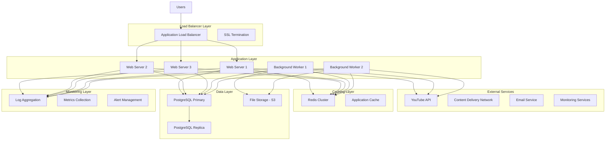
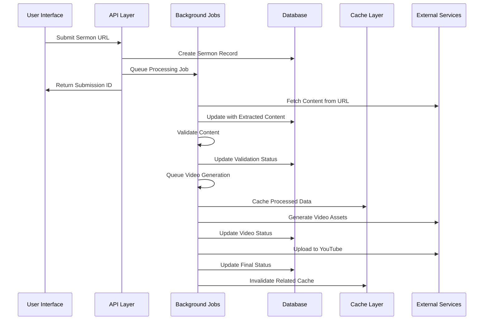
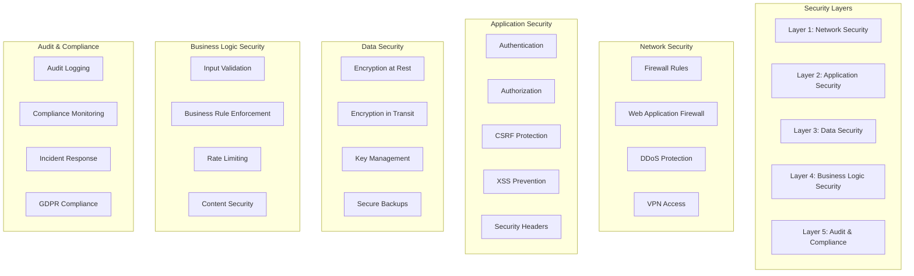

# Words of Truth System Architecture

## Overview

This document provides a comprehensive overview of the Words of Truth system architecture, including component relationships, data flow, security architecture, and scalability considerations.

## Table of Contents

1. [High-Level Architecture](#high-level-architecture)
2. [Component Architecture](#component-architecture)
3. [Data Architecture](#data-architecture)
4. [Security Architecture](#security-architecture)
5. [Processing Pipeline](#processing-pipeline)
6. [Scalability Architecture](#scalability-architecture)
7. [Infrastructure Architecture](#infrastructure-architecture)
8. [Integration Architecture](#integration-architecture)

## High-Level Architecture

### System Overview



### Core Principles

1. **Microservices Architecture**: Modular components with clear boundaries
2. **Event-Driven Processing**: Asynchronous processing for heavy operations
3. **Horizontal Scalability**: Ability to scale individual components
4. **Data Consistency**: ACID transactions with eventual consistency for caching
5. **Security by Design**: Multi-layered security with encryption at rest and in transit
6. **Observability**: Comprehensive logging, monitoring, and alerting

## Component Architecture

### Application Components

#### Web Application Layer

```ruby
# app/controllers/application_controller.rb
class ApplicationController < ActionController::Base
  include SecurityConcern
  include BusinessActivityLogging
  include PerformanceTracking
  
  before_action :authenticate_user!
  before_action :set_monitoring_context
  around_action :track_performance
  
  protected
  
  def set_monitoring_context
    RequestStore.store[:request_id] = request.uuid
    RequestStore.store[:user_id] = current_user&.id
    RequestStore.store[:ip_address] = request.remote_ip
  end
  
  def track_performance
    start_time = Time.current
    yield
  ensure
    duration = (Time.current - start_time) * 1000
    log_performance_metric(action_name, duration)
  end
end
```

#### Business Logic Layer

```ruby
# Business service architecture
module BusinessServices
  class SermonProcessingService
    include Interactor
    
    def call
      context.fail!(error: "Invalid sermon data") unless valid_sermon?
      
      extract_content
      validate_content
      process_content
      generate_artifacts
      schedule_video_generation
    end
    
    private
    
    def extract_content
      context.extracted_content = ContentExtractionService.call(context.source_url)
    end
    
    def validate_content
      context.validation_result = ContentValidationService.call(context.extracted_content)
    end
    
    def process_content
      ProcessedSermonService.call(context.validation_result)
    end
  end
end
```

#### Data Access Layer

```ruby
# Repository pattern for data access
class SermonRepository
  def self.find_with_videos(id)
    Sermon.includes(:videos).find(id)
  end
  
  def self.search(criteria)
    query = Sermon.includes(:videos)
    query = query.where(church: criteria[:church]) if criteria[:church].present?
    query = query.where("title ILIKE ?", "%#{criteria[:search]}%") if criteria[:search].present?
    query.order(:created_at).limit(criteria[:limit] || 25)
  end
  
  def self.recent_with_stats
    Rails.cache.fetch("sermons_recent_stats", expires_in: 5.minutes) do
      Sermon.includes(:videos)
            .where(created_at: 30.days.ago..Time.current)
            .group(:church)
            .count
    end
  end
end
```

### Background Processing Architecture

#### Job Processing System

```ruby
# Job hierarchy and organization
module Jobs
  class ApplicationJob < ActiveJob::Base
    include BusinessActivityLogging
    include ErrorHandling
    
    queue_as :default
    retry_on StandardError, wait: :exponentially_longer, attempts: 3
    
    around_perform do |job, block|
      log_job_start(job)
      block.call
      log_job_completion(job)
    rescue => e
      log_job_failure(job, e)
      raise
    end
  end
  
  # High-priority processing
  class VideoProcessingJob < ApplicationJob
    queue_as :critical
    
    def perform(video_id, options = {})
      video = Video.find(video_id)
      
      VideoGenerationService.new(video).call do |progress|
        broadcast_progress(video_id, progress)
      end
    end
    
    private
    
    def broadcast_progress(video_id, progress)
      ActionCable.server.broadcast(
        "video_processing_#{video_id}",
        { progress: progress, timestamp: Time.current }
      )
    end
  end
  
  # Batch processing for efficiency
  class BulkSermonProcessingJob < ApplicationJob
    queue_as :bulk
    
    def perform(sermon_ids)
      Sermon.where(id: sermon_ids).find_in_batches(batch_size: 10) do |batch|
        batch.each { |sermon| SermonProcessingJob.perform_later(sermon.id) }
      end
    end
  end
end
```

#### Queue Management

```ruby
# config/initializers/sidekiq.rb
Sidekiq.configure_server do |config|
  config.redis = {
    url: ENV['REDIS_URL'],
    network_timeout: 5,
    pool_timeout: 5,
    size: 25
  }
  
  # Queue priorities
  config.options[:queues] = %w[critical high default low bulk]
  
  # Memory management
  config.options[:memory_killer_max_memory] = 1_000_000_000 # 1GB
  config.options[:memory_killer_grace_time] = 900 # 15 minutes
  
  # Concurrency settings
  config.options[:concurrency] = ENV.fetch('SIDEKIQ_CONCURRENCY', 25).to_i
end
```

## Data Architecture

### Database Schema Design

#### Core Entities

```sql
-- Sermons: Central content entity
CREATE TABLE sermons (
    id BIGSERIAL PRIMARY KEY,
    title VARCHAR(255) NOT NULL,
    source_url TEXT UNIQUE NOT NULL,
    church VARCHAR(100) NOT NULL,
    pastor VARCHAR(100),
    denomination VARCHAR(50),
    scripture TEXT,
    sermon_date DATE,
    interpretation TEXT,
    action_points TEXT,
    audience_count INTEGER,
    created_at TIMESTAMP NOT NULL,
    updated_at TIMESTAMP NOT NULL,
    
    -- Indexes for performance
    CONSTRAINT sermons_title_length CHECK (length(title) >= 5),
    CONSTRAINT sermons_audience_positive CHECK (audience_count > 0)
);

-- Videos: Generated content
CREATE TABLE videos (
    id BIGSERIAL PRIMARY KEY,
    sermon_id BIGINT NOT NULL REFERENCES sermons(id) ON DELETE CASCADE,
    script TEXT NOT NULL,
    status VARCHAR(20) DEFAULT 'pending',
    youtube_id VARCHAR(50) UNIQUE,
    video_path TEXT,
    thumbnail_path TEXT,
    processing_started_at TIMESTAMP,
    processing_completed_at TIMESTAMP,
    created_at TIMESTAMP NOT NULL,
    updated_at TIMESTAMP NOT NULL,
    
    CONSTRAINT videos_status_valid CHECK (status IN ('pending', 'approved', 'processing', 'uploaded', 'failed'))
);

-- Business Activity Logs: Audit trail
CREATE TABLE business_activity_logs (
    id BIGSERIAL PRIMARY KEY,
    activity_type VARCHAR(50) NOT NULL,
    entity_type VARCHAR(50),
    entity_id BIGINT,
    user_id VARCHAR(100),
    operation_name VARCHAR(100),
    context JSONB,
    performed_at TIMESTAMP NOT NULL,
    created_at TIMESTAMP NOT NULL,
    
    -- Indexes for performance
    CONSTRAINT activity_type_valid CHECK (activity_type IN (
        'business_operation', 'user_interaction', 'state_transition',
        'data_access', 'security_event', 'compliance_event'
    ))
);
```

#### Performance Indexes

```sql
-- Search and filtering indexes
CREATE INDEX idx_sermons_church_date ON sermons(church, created_at);
CREATE INDEX idx_sermons_pastor ON sermons(pastor) WHERE pastor IS NOT NULL;
CREATE INDEX idx_sermons_denomination ON sermons(denomination) WHERE denomination IS NOT NULL;
CREATE INDEX idx_sermons_fulltext ON sermons USING gin(to_tsvector('english', title || ' ' || COALESCE(interpretation, '')));

-- Video processing indexes
CREATE INDEX idx_videos_status_created ON videos(status, created_at);
CREATE INDEX idx_videos_sermon_status ON videos(sermon_id, status);
CREATE INDEX idx_videos_youtube_id ON videos(youtube_id) WHERE youtube_id IS NOT NULL;

-- Business activity indexes
CREATE INDEX idx_business_logs_performed_at ON business_activity_logs(performed_at);
CREATE INDEX idx_business_logs_entity ON business_activity_logs(entity_type, entity_id);
CREATE INDEX idx_business_logs_activity_type ON business_activity_logs(activity_type, performed_at);
CREATE INDEX idx_business_logs_context ON business_activity_logs USING gin(context);

-- Composite indexes for common queries
CREATE INDEX idx_sermons_church_status_date ON sermons(church, created_at) 
  INCLUDE (title, pastor, denomination);
CREATE INDEX idx_videos_processing_queue ON videos(status, created_at) 
  WHERE status IN ('approved', 'processing');
```

### Data Flow Architecture

#### Sermon Processing Flow



#### Caching Strategy

```ruby
# Multi-level caching architecture
class CacheStrategy
  # L1: Application memory (fastest, smallest)
  class MemoryCache
    def self.get(key)
      Rails.cache.read(key)
    end
    
    def self.set(key, value, expires_in: 5.minutes)
      Rails.cache.write(key, value, expires_in: expires_in)
    end
  end
  
  # L2: Redis (fast, medium size)
  class RedisCache
    def self.get(key)
      Redis.current.get(key)
    end
    
    def self.set(key, value, expires_in: 30.minutes)
      Redis.current.setex(key, expires_in.to_i, value)
    end
  end
  
  # L3: Database query cache (medium speed, large)
  class QueryCache
    def self.get(key, &block)
      Rails.cache.fetch(key, expires_in: 1.hour, &block)
    end
  end
  
  # Smart cache selection
  def self.get_or_set(key, &block)
    # Try L1 first
    if value = MemoryCache.get(key)
      return value
    end
    
    # Try L2
    if value = RedisCache.get(key)
      MemoryCache.set(key, value)
      return value
    end
    
    # Generate fresh value
    value = block.call
    RedisCache.set(key, value)
    MemoryCache.set(key, value)
    value
  end
end
```

## Security Architecture

### Multi-Layer Security Model



### Authentication & Authorization

```ruby
# Multi-factor authentication system
class AuthenticationService
  def authenticate(email, password, mfa_token = nil)
    user = User.find_by(email: email)
    return false unless user&.authenticate(password)
    
    # Check MFA if enabled
    if user.mfa_enabled?
      return false unless verify_mfa_token(user, mfa_token)
    end
    
    # Log successful authentication
    log_security_event('successful_authentication', user)
    
    # Update last sign in
    user.update!(
      last_sign_in_at: Time.current,
      last_sign_in_ip: current_ip,
      sign_in_count: user.sign_in_count + 1
    )
    
    user
  end
  
  private
  
  def verify_mfa_token(user, token)
    totp = ROTP::TOTP.new(user.mfa_secret)
    valid = totp.verify(token, drift_behind: 30, drift_ahead: 30)
    
    log_security_event('mfa_verification', user, { success: valid })
    valid
  end
end

# Role-based authorization
class AuthorizationService
  PERMISSIONS = {
    'admin' => %w[manage_all view_all edit_all delete_all],
    'moderator' => %w[view_all edit_content moderate_content],
    'user' => %w[view_own edit_own create_content],
    'viewer' => %w[view_public]
  }.freeze
  
  def can?(user, action, resource = nil)
    return false unless user
    
    permissions = PERMISSIONS[user.role] || []
    return true if permissions.include?('manage_all')
    
    case action
    when 'view'
      can_view?(user, resource, permissions)
    when 'edit'
      can_edit?(user, resource, permissions)
    when 'delete'
      can_delete?(user, resource, permissions)
    else
      false
    end
  end
  
  private
  
  def can_view?(user, resource, permissions)
    return true if permissions.include?('view_all')
    return true if permissions.include?('view_public') && resource&.public?
    return true if permissions.include?('view_own') && resource&.user_id == user.id
    false
  end
end
```

### Data Encryption

```ruby
# Comprehensive encryption strategy
class EncryptionService
  # Field-level encryption
  def self.encrypt_sensitive_data(model)
    model.class.encrypted_attributes.each do |attribute, options|
      value = model.send(attribute)
      next unless value.present?
      
      encrypted_value = encrypt_field(value, options)
      model.send("#{attribute}_encrypted=", encrypted_value)
      
      # Create searchable index if needed
      if options[:searchable]
        index_value = create_searchable_index(value)
        model.send("#{attribute}_bidx=", index_value)
      end
    end
  end
  
  # Database-level encryption
  def self.encrypt_field(value, context = {})
    cipher = OpenSSL::Cipher.new('aes-256-gcm')
    cipher.encrypt
    
    key = derive_key(context)
    iv = cipher.random_iv
    
    cipher.key = key
    cipher.iv = iv
    
    encrypted = cipher.update(value) + cipher.final
    auth_tag = cipher.auth_tag
    
    # Combine IV + auth_tag + encrypted data
    Base64.strict_encode64(iv + auth_tag + encrypted)
  end
  
  # Key derivation with context
  def self.derive_key(context = {})
    base_key = Rails.application.credentials.secret_key_base
    context_string = context.sort.to_h.to_json
    
    OpenSSL::PKCS5.pbkdf2_hmac_sha256(
      base_key + context_string,
      'wordsoftruth_salt',
      10_000,
      32
    )
  end
end
```

## Processing Pipeline

### Sermon Processing Pipeline


### Video Generation Pipeline

```ruby
class VideoGenerationPipeline
  include Interactor::Organizer
  
  organize VideoScriptGenerator,
           VisualElementGenerator,
           AudioElementGenerator,
           VideoCompositor,
           QualityValidator,
           YouTubeUploader,
           NotificationSender
  
  def self.call(video_id, options = {})
    context = { video_id: video_id, options: options }
    
    # Execute pipeline with error handling
    result = super(context)
    
    if result.success?
      log_pipeline_success(video_id, result.duration)
    else
      log_pipeline_failure(video_id, result.error)
      handle_pipeline_failure(video_id, result.error)
    end
    
    result
  end
  
  private
  
  def self.handle_pipeline_failure(video_id, error)
    video = Video.find(video_id)
    video.mark_failed!(error.message)
    
    # Notify relevant stakeholders
    AdminNotificationMailer.video_processing_failed(video, error).deliver_later
    
    # Schedule retry if appropriate
    if retryable_error?(error)
      VideoProcessingJob.set(wait: 30.minutes).perform_later(video_id)
    end
  end
end
```

## Scalability Architecture

### Horizontal Scaling Strategy

```yaml
# Kubernetes deployment configuration
apiVersion: apps/v1
kind: Deployment
metadata:
  name: wordsoftruth-web
spec:
  replicas: 3
  selector:
    matchLabels:
      app: wordsoftruth-web
  template:
    metadata:
      labels:
        app: wordsoftruth-web
    spec:
      containers:
      - name: app
        image: wordsoftruth/app:latest
        ports:
        - containerPort: 3000
        env:
        - name: RAILS_ENV
          value: "production"
        - name: DATABASE_URL
          valueFrom:
            secretKeyRef:
              name: database-secret
              key: url
        resources:
          requests:
            memory: "512Mi"
            cpu: "250m"
          limits:
            memory: "1Gi"
            cpu: "500m"
        livenessProbe:
          httpGet:
            path: /health
            port: 3000
          initialDelaySeconds: 30
          periodSeconds: 10
        readinessProbe:
          httpGet:
            path: /health
            port: 3000
          initialDelaySeconds: 5
          periodSeconds: 5
---
apiVersion: v1
kind: Service
metadata:
  name: wordsoftruth-web-service
spec:
  selector:
    app: wordsoftruth-web
  ports:
  - protocol: TCP
    port: 80
    targetPort: 3000
  type: LoadBalancer
```

### Auto-Scaling Configuration

```yaml
# Horizontal Pod Autoscaler
apiVersion: autoscaling/v2
kind: HorizontalPodAutoscaler
metadata:
  name: wordsoftruth-web-hpa
spec:
  scaleTargetRef:
    apiVersion: apps/v1
    kind: Deployment
    name: wordsoftruth-web
  minReplicas: 3
  maxReplicas: 10
  metrics:
  - type: Resource
    resource:
      name: cpu
      target:
        type: Utilization
        averageUtilization: 70
  - type: Resource
    resource:
      name: memory
      target:
        type: Utilization
        averageUtilization: 80
  behavior:
    scaleUp:
      stabilizationWindowSeconds: 300
      policies:
      - type: Percent
        value: 50
        periodSeconds: 60
    scaleDown:
      stabilizationWindowSeconds: 600
      policies:
      - type: Percent
        value: 25
        periodSeconds: 60
```

### Database Scaling Strategy

```ruby
# Read replica configuration
class ApplicationRecord < ActiveRecord::Base
  connects_to database: { 
    writing: :primary, 
    reading: :replica 
  }
  
  # Automatic read/write routing
  def self.search_sermons(criteria)
    # Use read replica for search queries
    connected_to(role: :reading) do
      SermonRepository.search(criteria)
    end
  end
  
  def self.create_sermon(attributes)
    # Use primary for writes
    connected_to(role: :writing) do
      Sermon.create!(attributes)
    end
  end
end
```

## Infrastructure Architecture

### Cloud Infrastructure (AWS)

```yaml
# CloudFormation template for infrastructure
AWSTemplateFormatVersion: '2010-09-09'
Description: 'Words of Truth Production Infrastructure'

Resources:
  # VPC and Networking
  VPC:
    Type: AWS::EC2::VPC
    Properties:
      CidrBlock: 10.0.0.0/16
      EnableDnsHostnames: true
      EnableDnsSupport: true
  
  # Application Load Balancer
  ApplicationLoadBalancer:
    Type: AWS::ElasticLoadBalancingV2::LoadBalancer
    Properties:
      Scheme: internet-facing
      Type: application
      Subnets: 
        - !Ref PublicSubnet1
        - !Ref PublicSubnet2
      SecurityGroups:
        - !Ref ALBSecurityGroup
  
  # ECS Cluster for containers
  ECSCluster:
    Type: AWS::ECS::Cluster
    Properties:
      ClusterName: wordsoftruth-production
      CapacityProviders:
        - FARGATE
        - FARGATE_SPOT
  
  # RDS Database with Multi-AZ
  Database:
    Type: AWS::RDS::DBInstance
    Properties:
      DBInstanceClass: db.r5.xlarge
      Engine: postgres
      EngineVersion: '15.4'
      AllocatedStorage: 500
      StorageType: gp3
      MultiAZ: true
      BackupRetentionPeriod: 30
      StorageEncrypted: true
      VPCSecurityGroups:
        - !Ref DatabaseSecurityGroup
  
  # ElastiCache Redis Cluster
  RedisCluster:
    Type: AWS::ElastiCache::ReplicationGroup
    Properties:
      ReplicationGroupDescription: Redis cluster for caching
      CacheNodeType: cache.r6g.large
      Engine: redis
      NumCacheClusters: 3
      AutomaticFailoverEnabled: true
      MultiAZEnabled: true
      SecurityGroupIds:
        - !Ref RedisSecurityGroup
  
  # S3 Bucket for file storage
  S3Bucket:
    Type: AWS::S3::Bucket
    Properties:
      BucketName: wordsoftruth-production-storage
      VersioningConfiguration:
        Status: Enabled
      PublicAccessBlockConfiguration:
        BlockPublicAcls: true
        BlockPublicPolicy: true
        IgnorePublicAcls: true
        RestrictPublicBuckets: true
      BucketEncryption:
        ServerSideEncryptionConfiguration:
          - ServerSideEncryptionByDefault:
              SSEAlgorithm: AES256
```

### Monitoring and Observability

```ruby
# Application monitoring setup
class MonitoringService
  def self.setup_application_monitoring
    # Performance monitoring
    NewRelic::Agent.manual_start if Rails.env.production?
    
    # Error tracking
    Sentry.init do |config|
      config.dsn = ENV['SENTRY_DSN']
      config.environment = Rails.env
      config.release = ENV['APP_VERSION']
    end
    
    # Custom metrics
    StatsD.increment('application.started')
    StatsD.gauge('application.version', ENV['APP_VERSION'])
  end
  
  def self.track_business_metrics
    Thread.new do
      loop do
        track_sermon_metrics
        track_video_metrics
        track_user_metrics
        sleep 60
      end
    end
  end
  
  private
  
  def self.track_sermon_metrics
    StatsD.gauge('sermons.total', Sermon.count)
    StatsD.gauge('sermons.today', Sermon.where(created_at: Date.current.all_day).count)
    StatsD.gauge('sermons.processing', Sermon.joins(:videos).where(videos: { status: 'processing' }).count)
  end
end
```

## Integration Architecture

### External Service Integration

```ruby
# Service integration layer
module Integrations
  class YouTubeService
    include HTTParty
    base_uri 'https://www.googleapis.com/youtube/v3'
    
    def initialize(api_key)
      @api_key = api_key
      @auth_headers = { 'Authorization' => "Bearer #{api_key}" }
    end
    
    def upload_video(video_file, metadata)
      # Upload video with retry logic
      retry_with_backoff(max_retries: 3) do
        response = self.class.post('/videos', {
          headers: @auth_headers,
          body: build_upload_body(video_file, metadata)
        })
        
        handle_youtube_response(response)
      end
    end
    
    private
    
    def retry_with_backoff(max_retries: 3, &block)
      retries = 0
      begin
        yield
      rescue => e
        retries += 1
        if retries <= max_retries
          sleep_time = 2 ** retries
          sleep(sleep_time)
          retry
        else
          raise e
        end
      end
    end
  end
  
  # Integration health monitoring
  class IntegrationHealthMonitor
    def self.check_all_integrations
      {
        youtube: check_youtube_health,
        email: check_email_health,
        storage: check_storage_health,
        monitoring: check_monitoring_health
      }
    end
    
    private
    
    def self.check_youtube_health
      youtube_service = YouTubeService.new(ENV['YOUTUBE_API_KEY'])
      youtube_service.get_quota_usage
      { status: 'healthy', last_check: Time.current }
    rescue => e
      { status: 'unhealthy', error: e.message, last_check: Time.current }
    end
  end
end
```

This comprehensive system architecture documentation provides a detailed view of how all components work together to create a scalable, secure, and maintainable system for the Words of Truth application.